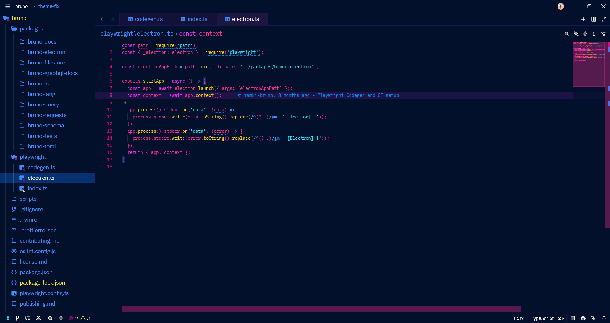
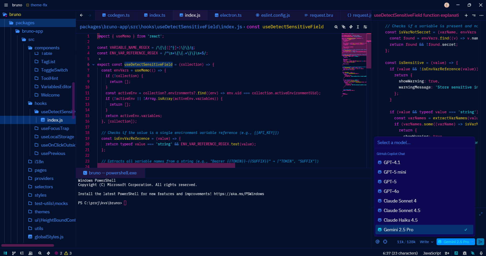

# KvS Cyberpunk 2077 Theme for Zed

A vibrant, neon-soaked theme for [Zed](https://zed.dev) inspired by the aesthetics of Cyberpunk 2077 and the original VS Code 2077 theme.

## Preview





### Color Highlights

- **Deep blues and purples** for backgrounds (`#03102c`, `#0e0952`)
- **Hot pink and magenta** for syntax highlighting (`#ff2e97`, `#ee0077`)
- **Cyan accents** for strings and links (`#0ef3ff`)
- **Golden yellow** for functions and numbers (`#ffd400`)
- **Neon scrollbars** with pink highlights

## Installation

### From Zed Extensions

1. Open Zed
2. Press `Cmd+Shift+P` (Mac) or `Ctrl+Shift+P` (Windows/Linux)
3. Type "Extensions: Install Extensions"
4. Search for "KvS Cyberpunk 2077"
5. Click Install

### Manual Installation

1. Clone this repository:
   ```bash
   git clone https://github.com/notKvS/2077-zed.git
   ```

2. Copy the extension to your Zed extensions directory:
   - **macOS/Linux**: `~/.config/zed/extensions/`
   - **Windows**: `%APPDATA%\Zed\extensions\`

3. Restart Zed

## Usage

1. Open Zed settings: `Cmd+,` (Mac) or `Ctrl+,` (Windows/Linux)
2. Search for "theme"
3. Select **KvS Cyberpunk 2077** from the dropdown

Or use the command palette:
1. Press `Cmd+K` then `Cmd+T` (Mac) or `Ctrl+K` then `Ctrl+T` (Windows/Linux)
2. Select **KvS Cyberpunk 2077**

## Color Palette

| Element | Color | Hex |
|---------|-------|-----|
| Background | Deep Blue | `#03102c` |
| Surface | Purple | `#0e0952` |
| Primary Text | White | `#ffffff` |
| Editor Foreground | Hot Pink | `#ff2e97` |
| Accent | Cyan | `#0ef3ff` |
| Functions | Yellow | `#ffd400` |
| Keywords | Magenta | `#ff2cf1` |
| Strings | Cyan | `#0ef3ff` |
| Comments | Blue | `#0098df` |

## Features

- Full syntax highlighting for popular languages
- Carefully crafted terminal colors (ANSI 16-color palette)
- High contrast for better readability
- Themed UI elements (scrollbars, borders, tabs)
- Optimized for long coding sessions

## Development

To modify or contribute to this theme:

1. Fork this repository
2. Edit `themes/KvS-2077.json` to customize colors
3. Update the version in `extension.toml`
4. Test locally by copying to your Zed extensions directory
5. Submit a pull request

## Credits

- **Author**: [notKvS](https://github.com/notKvS)
- **Inspired by**: VS Code 2077 theme
- **Game**: Cyberpunk 2077 by CD Projekt Red

## License

This project is licensed under the GNU General Public License v3.0 - see the [LICENSE](LICENSE) file for details.

## Changelog

### 0.0.2
- Added missing terminal ANSI black color definitions
- Updated extension ID for better compatibility

### 0.0.1
- Initial release
- Complete Cyberpunk 2077 color scheme
- Support for all major syntax elements

---